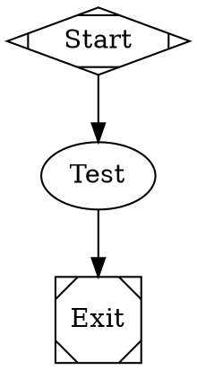

Fabro renders `{{ ... }}` templates in exactly two workflow attributes: the graph `goal` and node `prompt`s. Every other attribute is literal text.

## Template context

Goal and prompt templates can reference:

| Expression | Resolves to |
|---|---|
| `{{ goal }}` | The workflow goal |
| `{{ inputs.name }}` | A value from `[run.inputs]`, optionally overridden by CLI input flags |

Environment variables are **not** available in goal or prompt templates. Use `{{ env.NAME }}` only in config strings and HTTP hook headers.

## Run config inputs

Define typed inputs in `[run.inputs]`:

```toml title="run.toml"
_version = 1

[workflow]
graph = "check.fabro"

[run]
goal = "Run repository checks"

[run.inputs]
repo_name = "fabro"
repo_url = "https://github.com/fabro-sh/fabro"
language = "rust"
```

These values are available in the graph `goal` and node `prompt` attributes:



Other attributes — `script`, `label`, `model`, `provider`, `condition`, and all edge attributes — do not render templates. If one of them contains `{{ … }}` or ``, the syntax is treated as literal text and Fabro records a `detemplated_attribute` warning suggesting you move the dynamic value into a `prompt` or `goal`.

Override individual inputs at run time with repeatable `-I` / `--input` flags:

```bash
fabro run .fabro/workflows/check/workflow.toml -I repo_name=fabro-2 --input language=rust
```

CLI input values use TOML scalar parsing when possible. Quoted strings, booleans, integers, and floats keep their typed values; unquoted bare text falls back to a string. Empty values such as `foo=` are accepted as empty strings. Arrays, inline tables, and datetimes are rejected.

## Server-managed run config variables

Use server-managed variables for non-sensitive values that should be shared across runs, such as deployment environments, default branches, regions, or image tags:

```bash
fabro variable set DEPLOY_ENV staging --description "Deployment target"
```

Run configuration strings can reference these values with `{{ vars.NAME }}`:

```toml title="workflow.toml"
_version = 1

[run]
goal = "Deploy {{ vars.DEPLOY_ENV }}"
```

Variables are intentionally readable: `fabro variable list` and `fabro variable get DEPLOY_ENV` show stored values. Do not store tokens, API keys, or credentials as variables; use `fabro secret set` for sensitive values.

## `goal`

Agent and prompt nodes also receive the workflow goal at runtime:

```dot title="example.fabro"
digraph Example {
    graph [goal="Implement the login feature"]

    plan [label="Plan", prompt="Create a plan for: {{ goal }}"]
}
```



That prompt becomes `Create a plan for: Implement the login feature`.

## Expansion timing

Fabro keeps workflow structure static and renders workflow templates once:

1. Fabro parses the root DOT and imported `.fabro` files without rendering them.
2. Literal `import`, `@file`, graph-goal file, and child-workflow references are resolved.
3. The graph `goal` and node `prompt` attributes are rendered with the `{ goal, inputs }` context.

Templates are not supported in graph syntax, node IDs, edge structure, `import` paths, `@file` paths, child workflow paths, other file references, or any attribute besides `prompt` and `goal`.

Fabro renders the graph `goal` first and stores the rendered value back onto the graph. Prompts that use `{{ goal }}` receive that rendered value.

## Undefined variables

Fabro renders undefined workflow variables as empty text and records a `template_undefined_variable` diagnostic. `fabro validate` reports that diagnostic as a warning so you can validate workflow structure before all inputs are known. Run-style commands such as `fabro run`, `fabro create`, and preflight promote the same diagnostic to an error before proceeding.

## Template includes

Prompt and goal templates support static MiniJinja loader dependencies such as ``. Includes are resolved relative to the template file being rendered and can be nested.

Fabro discovers those static dependencies while building the run manifest so sandbox providers receive every required prompt file. Dynamic loader expressions such as `` are rejected; use a literal include path and choose content with normal template conditionals instead.

## Escaping

To emit literal template syntax, use MiniJinja escaping:

```dot
test [prompt="{{ goal }}"]
```

You can also emit literal braces with expressions such as `{{ '{{' }}` when needed.

## Input merging

TOML `[run.inputs]` tables intentionally replace the inherited map wholesale rather than merging by key. Whichever TOML layer has the highest precedence and sets `[run.inputs]` wins its entire map.

CLI input flags are different: they are sparse per-key overrides applied after config resolution, so unrelated inherited inputs remain available. If a key is repeated on the CLI, the last value wins.

| Source | Priority |
|---|---|
| CLI flags (`-I key=value` / `--input key=value`, repeated; per-key merge) | Highest |
| `workflow.toml` `[run.inputs]` | |
| `.fabro/project.toml` `[run.inputs]` | |
| `~/.fabro/settings.toml` `[run.inputs]` | Lowest |
